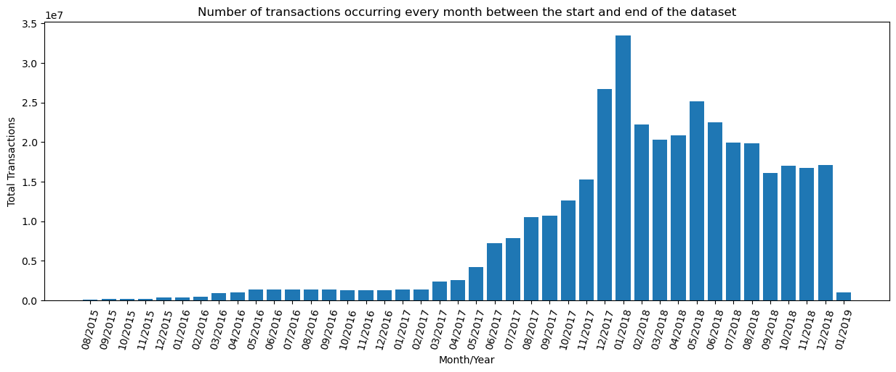

## Part A. Time Analysis (25%)

### 1.1 Total Transactions

#### 1.1.1 Objective:
To create a bar plot showing the number of transactions occurring every month between the start and end of the dataset.

#### 1.1.2 Data Source:
The data used in this analysis was fetched from a CSV file stored in an S3 bucket:

_**transactions.csv:**_  The transactions file contains information about Ethereum transactions.

#### 1.1.3 Execution:

1. Execute the spark application.

    ```sh
    ccc create spark transactions-total.py -s
    ```
2. Stream the logs of the drive container.

    ```sh
    oc logs -f spark transactions-total-spark-app-driver
    ```
  
#### 1.1.4 Methodology:

- The Spark script begins by initializing a Spark session.

- The Spark script then fetches environment variables required for S3 storage [S3 endpoint URL, access key ID, secret access key, and the bucket name]. The Hadoop configuration is then set to allow Spark to access the S3 bucket.

- The transactions and contracts files are then fetched from the S3 bucket using the ``textFile()`` method. The ``verify_transactions`` and ``verify_contracts ``methods are used to filter out any lines in the datasets that do not conform to their respective formats.

- The transactions dataset is then transformed using a map operation that extracts the Ethereum address and transaction value from each line. 
- The contracts dataset is transformed using a map operation that associates a value of 1 with each contract address. 
- The ``reduceByKey()`` operation is then used to group the transaction values by address, and the join() operation is used to join the grouped transaction values with the contracts dataset. 
- Finally, a map operation is used to extract the address and total transaction value from the joined dataset.
- The ``takeOrdered()`` method is used to get the top 10 smart contracts based on their total transaction value.
- The results are then written to S3 bucket as a TXT file using the boto3 library, and the Spark session is stopped.

#### 1.1.5 Output:
The bar plot showing the total number of transactions occurring each month between the start and end of the dataset is obtained. The code used to obtain this graph can be found in `PartA/transactions_total.ipynb`



### 1.2 Average Transactions

#### 1.2.1 Objective:
To create a bar plot showing the average value of transaction in each month between the start and end of the dataset.

#### 1.2.2 Data Source:
The data used in this analysis was fetched from a CSV file stored in an S3 bucket:

_**transactions.csv:**_  The transactions file contains information about Ethereum transactions.

#### 1.2.3 Execution:

1. Execute the spark application.

    ```sh
    ccc create spark transactions-average.py -s
    ```
2. Stream the logs of the drive container.

    ```sh
    oc logs -f spark transactions-average-spark-app-driver
    ```

#### 1.2.4 Methodology:

1.  ***Initializing a Spark session:*** The first step of the code is to initialize a Spark session using the `SparkSession` object. The `appName` argument is set to "Ethereum" to identify the Spark application, and `getOrCreate()` method is called to create a new Spark session or retrieve an existing one.
    
2.  ***Defining a method to verify the format of the transactions data:*** This method `verify_transaction()` that takes every single line of transactions data as input and returns `True` if the data is in the correct format and `False` otherwise.
    
3.  ***Fetching S3 environment variables:*** This step involves fetching environment variables related to the S3 bucket, like the data repository bucket, endpoint URL, access key ID, secret access key, and bucket name.
    
4.  ***Configuring Hadoop settings for the Spark session:*** Hadoop settings for the Spark session is configured using the `hadoopConf` object. This involves setting the S3 endpoint, access key, secret key, and SSL connection properties.
    
5.  ***Definining a method to extract features from the transactions data and aggregate values for average transaction value calculation:*** This method `mapping()` takes every single single line of transactions data as input and returns a tuple of date and a tuple of transaction value and count. The date is extracted from the timestamp in the 12th field of the data, and the transaction value is converted to a float. This method is used to extract features from the data and aggregate values for calculating the average transaction value per month.
    
6.  ***Fetching and Filtering:*** The transactions.csv file is fetched from the S3 bucket using the `textFile()` method of the Spark context. Then the `verify_transaction()` function is used as a filter condition to remove invalid transactions data.
    
8.  ***Mapping the transactions data to extract features and aggregate values for average transaction value calculation:*** The `mapping()` method is used to extract features and aggregate values for calculating the average transaction value per month. The resulting RDD contains tuples of date and a tuple of transaction value and count.
    
9.  ***Reducing the transactions data by date to calculate the average transaction value per month:*** `reduceByKey()` method is used to reduce the transactions data by date of the RDD object. The `lambda` function is used to add the transaction values and counts for each date. The resulting RDD contains tuples of date and a tuple of total transaction value and count.
    
10.  ***Storing the results in an S3 bucket:*** The results are stored in an S3 bucket using the `Object()` and `put()` methods of the `boto3.resource()` object. The results are stored as a text file.

#### 1.2.5 Output:
The bar plot showing the average value of transaction in each month between the start and end of the dataset is obtained. The code used to obtain this graph can be found in `PartA/transactions_avg.ipynb`


